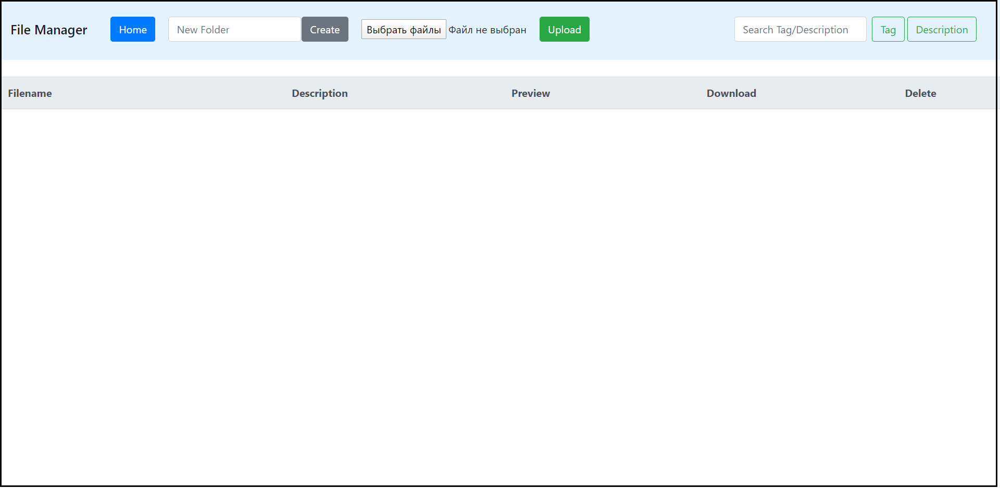

# File manager
File manager for 3D models



## Getting Started
### Installation

- Clone this repo:
```bash
git clone https://github.com/quantum73/file_manager.git
cd ../file_manager
```

- After cloning the repository you need to add two folders (<code>data</code> and <code>img</code>) in root folder <code>../file_manager</code>

- For pip users, please type the command `pip install -r requirements.txt`.

### Run server
```bash
python main.py
```