# File manager
File manager for 3D models

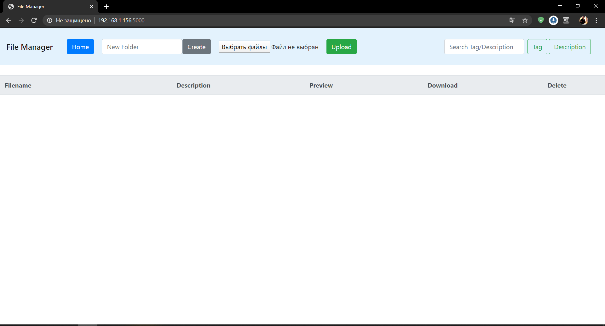

## Getting Started
### Installation

- Clone this repo:
```bash
git clone https://github.com/quantum73/file_manager.git
cd ../file_manager
```

- After cloning the repository you need to add two folders (<code>data</code> and <code>img</code>) in root folder <code>../file_manager</code>

- For pip users, please type the command `pip install -r requirements.txt`.

### Run server
```bash
python main.py
```

- Copy this address and paste it into the browser's address bar

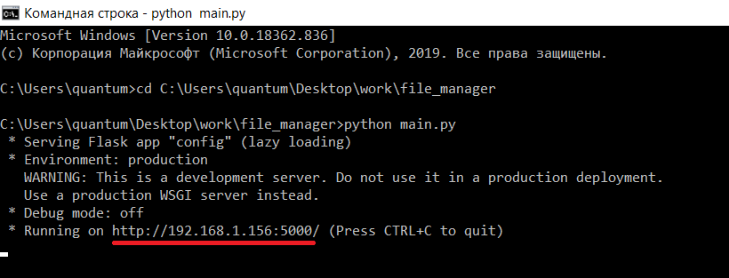

## Manual
### Кнопка <i>Home</i>

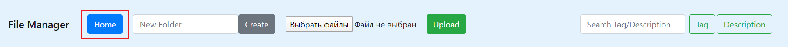

Кнопка <b>Home</b> возвращает в корень

### Поле создания новой папки (тэга)

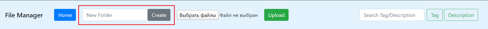

В поле <b>New folder</b> вводится название папки (тэга), которую вы ходите создать.
Нажатие кнопки <b>Create</b> создаёт данную папку.

### Поле загрузки файла модели

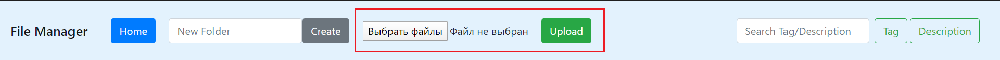

Выбирается нужный файл модели для загрузки на сервер, нажатие кнопки <b>Upload</b> загружает файл на сервер.

<i>Примечания:</i>
- За раз можно загрузить только один файл
- Поддерживаемые расширения файлов: ```bash .obj, .zip, .rar, .blend, .fbx ```
- Если формат не соответствует ни одному из вышеперечисленных, выводится сообщение <b>Wrong format file</b>.
  

### Поиск по тэгу/описанию

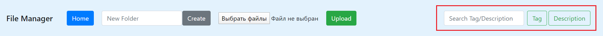

В поле поиска <b>Search Tag/Description</b> вводится название тэга или часть описания, в зависимости от того, что вы ходите найти.
Кнопка <b>Tag</b> выполняет поиск по тэгу(название папки), а кнопка <b>Description</b> выполняет поиск по описанию, соответственно.

<i>Примечания:</i>
- Если тэг не был найден, то выводится следующее сообщение:
  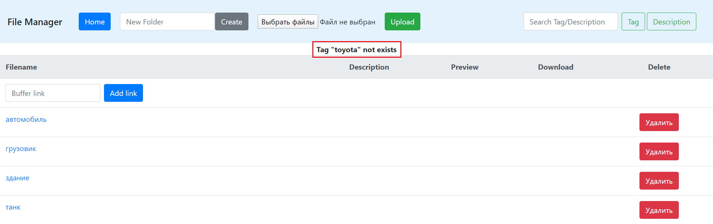
  В кавычках указывается название тэга, который вы искали.
  В нашем случае это тэг <i>toyota</i>.
- Если не найдено соответствие описанию, то выводится следующее сообщение:
  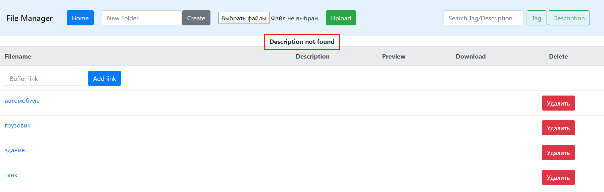

### Добавление модели в виде ссылки на Buffer

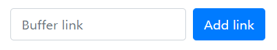

Для добавить модель в виде ссылки на Buffer введите в поле <b>Buffer link</b> ссылку на файл в Buffer и нажмите <b>Add link</b>

### Описание загруженной модели

При загрузке файла в колонке <b>Description</b> появляется возможность редактирования описания модели.
Изначально, при загрузке, у модели нет описания и описание заполняется фразой <i>no_desc</i>:

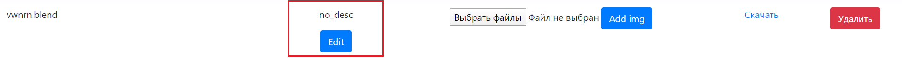

Кнопка <b>Edit</b> открывает поле для изменения описания:

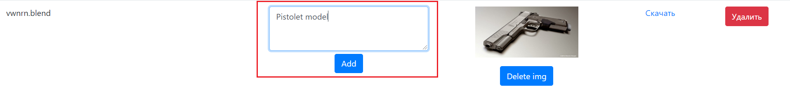

Для примения изменений нажмите кнопку <b>Add</b>:

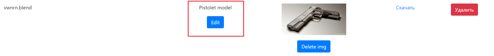

### Добавление/удаление preview изображения модели

При загрузке файла в колонке <b>Preview</b> появляется возможность добавить preview изображения к модели:

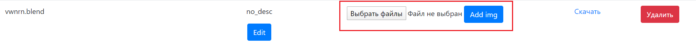

Поддерживаемые расширения изображений: ```bash .png, .jpg, .jpeg, .bmp ```

Загруженное изображение можно заменить, нажав кнопку <b>Delete</b>:

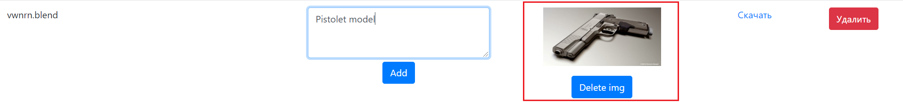

### Скачивание модели

Чтобы скачать модель в колонке <b>Download</b> нажмите на <b>Скачать</b>:

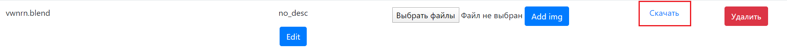

### Удаление файла/тэга(папки)

Чтобы удалить файл/тэг(папку) в колонке <b>Delete</b> нажмите кнопку <b>Удалить</b>:

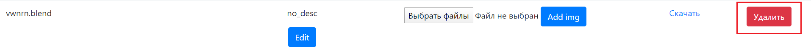